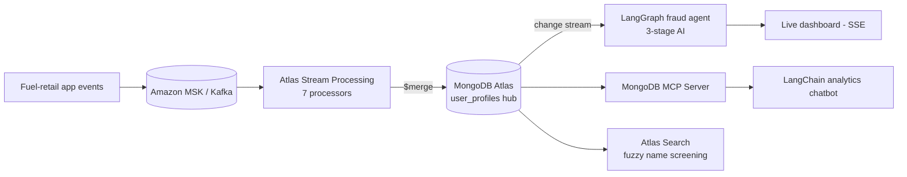

# Fuel Retail Platform — Fraud, Analytics & Compliance on MongoDB Atlas

> **One integrated platform demonstrating three production use cases: real-time fraud detection, an analytics chatbot, and name-screening compliance — all on MongoDB Atlas.**
> Sanitized public version of a real-world prototype — client names, credentials, and internal endpoints removed; all configuration is environment-driven (`.env.example`). Authored by [Paul Cleenewerck](https://github.com/pcleene).

## Context

A fuel-retail / digital-wallet business needs to stop fraud as it happens, let analysts ask questions in natural language, and screen customers against watchlists — without standing up three separate data platforms. This project builds all three on a **single Atlas data model**, where one `user_profiles` document is the hub that the streaming pipeline, the analytics agent, and the screening service all read and write.

## Architecture



## The three use cases

| Use case | MongoDB capabilities |
|----------|----------------------|
| **UC1 — Real-time fraud detection & AI investigation** | Atlas Stream Processing, Change Streams, LangGraph agent, Vector Search |
| **UC2 — Natural-language analytics chatbot** | MongoDB MCP Server, LangChain agent, Scheduled Triggers, Materialized Views |
| **UC3 — Name-screening compliance** | Atlas Search, fuzzy matching, custom analyzers, Search Nodes |

## What this demonstrates

- **Stream processing without a separate engine** — signal detection runs directly in Atlas Stream Processing (no NestJS/KSQL/Flink middleware), writing state back into Atlas with `$merge`.
- **Event-driven AI** — a Change Stream triggers a multi-stage LangGraph agent that investigates flagged users and persists an investigation report.
- **Agentic analytics** — the MongoDB MCP Server lets an LLM query the operational data safely for ad-hoc business questions.
- **Search-based compliance** — fuzzy matching with custom analyzers screens customers against negative lists on Search Nodes.
- **One document, many consumers** — a deliberate single-hub schema keeps `$lookup` joins and single-document updates fast and atomic across all three use cases.

## Tech stack

FastAPI (Python) · SvelteKit · Amazon MSK (Kafka) · Atlas Stream Processing · MongoDB Atlas (Search + Vector Search + Change Streams) · LangGraph / LangChain · MongoDB MCP Server

## Quick start

```bash
cp .env.example .env            # add your Atlas URI + provider keys
cd backend && pip install -r requirements.txt && uvicorn main:app --reload
cd frontend && npm install && npm run dev
```

See `Project Implementation Walkthrough.md` and `docs/` for per-use-case walkthroughs and the stream-processing pipeline definitions.

## Author

[Paul Cleenewerck](https://github.com/pcleene) — MongoDB-focused solution architecture and hands-on prototyping.

## License

See `LICENSE`. If no license file is present, contact the author before reuse.
